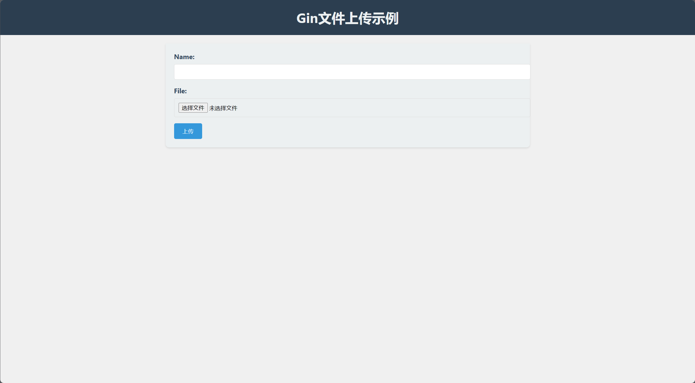

# Gin-FileUpload-Example

这是一个使用 `Gin` 框架实现的简单文件上传示例项目。项目演示了如何使用 Gin 构建一个基本的文件上传功能，包括前端页面和后端逻辑。用户可以上传文件，并为文件提供一个附加的名称信息。

## 目录结构

```shell
upload/
├── public/
│   └── index.html
├── static/
├── README.md
├── go.mod
├── go.sum
├── main.go
└── router.go
```

`upload/`: 项目的根目录。
- `public/`：存放前端资源，包含一个简单的上传页面 `index.html`。
  - `index.html`：一个简单的表单页面，允许用户上传单个文件。
- `static/`: 存放上传的静态资源（上传后的文件会保存在这里）。
- `README.md`: 项目的说明文档。
- `go.mod`: Go 模块文件，用于管理项目的依赖。
- `go.sum`: Go 依赖的版本校验文件。
- `main.go`: 项目的入口文件，创建了一个 Gin 实例并初始化了 HTTP 服务器。
- `router.go`: 定义了路由和文件上传的逻辑。


## 如何使用

1. 确保你已经安装了 Go 编程语言。
2. 将项目克隆到本地：
   ```shell
   git clone git@github.com:zheng-yi-yi/Gin-FileUpload-Example.git
   ```
3. 进入项目目录：
   ```shell
   cd upload
   ```
4. 更新依赖：
   ```shell
   go mod tidy
   ```
5. 构建项目
   ```shell
   go build
   ```
6. 运行项目，启动服务器
   ```go
   ./upload
   ```
7. 在浏览器中访问 `http://localhost:8080/`，即看到文件上传页面，开始上传文件吧！



## 注意事项

- 该示例项目主要用于演示文件上传的基本原理和使用 `Gin` 框架的方法，不适用于生产环境。
- 请不要在公共服务器上部署此示例，仅限于学习和测试目的。

## 贡献

欢迎贡献你的代码来改进这个示例项目。如果你发现了问题或者有改进建议，请提交一个 `Issue` 或者发起一个 `Pull` 请求。